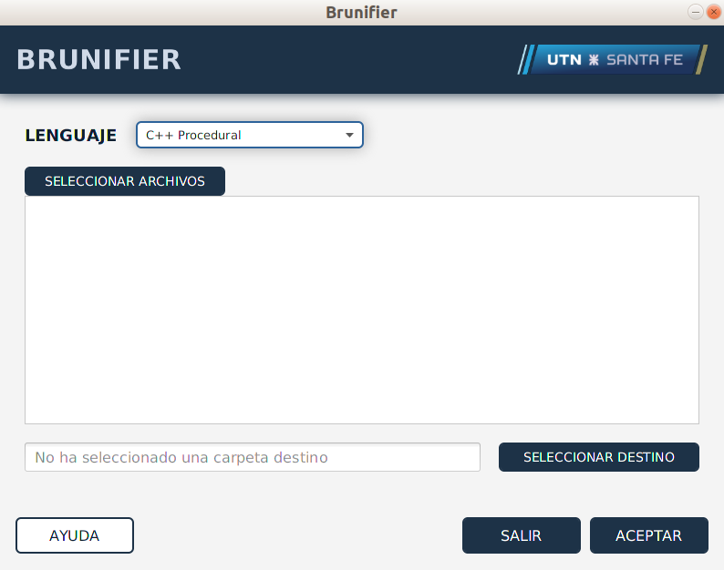

# Herramienta de soporte para no videntes
### UTN - FRSF
Adaptación de herramientas de programación para personas no videntes. Estructurada de formal tal que permite ser facilmente extensible a otros lenguajes.

### En Ubuntu

Chequear que se tiene JFX. Si no, hacer 'sudo apt-get install openjfx'

## C++

- Añade marcas que indican el fin de bloques del tipo if, switch, struct, for, etc.
- Añade marcas que indican entre qué líneas se encuentra definida una función

## Smalltalk

- Añade marcas que indican el comienzo y fin de clases y métodos.

## Scheme

- Añade marcas que indican el fin de abstracciones y aplicaciones funcionales.

## Pharo
- <Completar>
